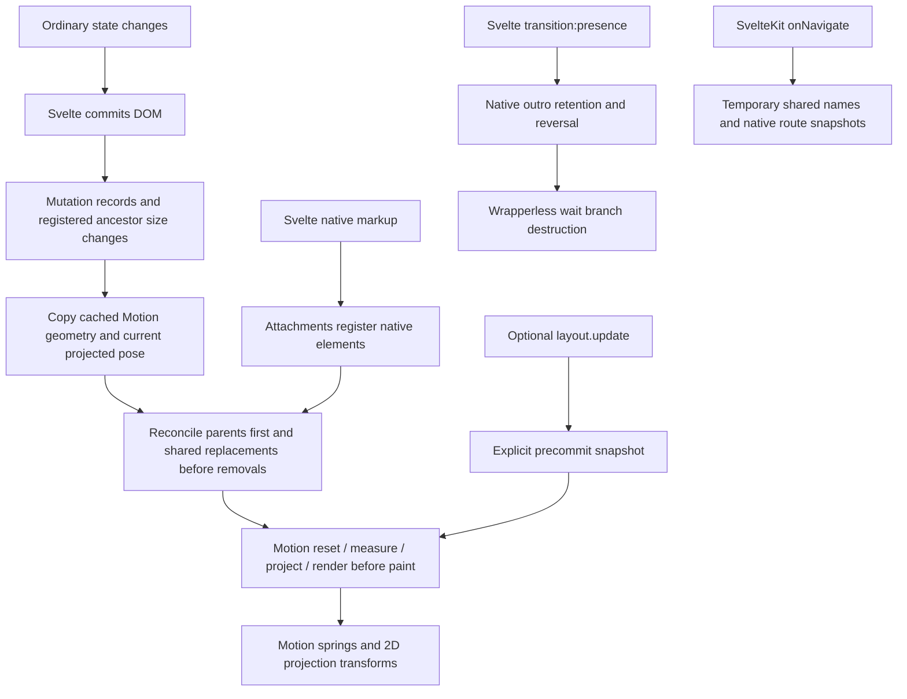

# Astra motion: research prototype

**Recommendation: adopt the Svelte/Motion hybrid with the exact dependency pin and
scoped adapter compatibility fix, without compiler integration.** Automatic layout now uses ordinary
Svelte assignments. The explicit transaction remains available for controlled workloads.

**State expansion:** `createMotion` now adds initial/update/exit targets, matching SSR
styles, shared VisualElement ownership, variants/orchestration, MotionValues, gestures,
and context defaults. Complete examples and the remaining boundaries are in the
[state API](research/state-api.md) and [implementation report](research/state-implementation.md).

The follow-up breakthrough is that Motion's cached layout and current projected pose
can seed a postcommit snapshot. This works through interruption, nested projection and
shared replacement without relying on an attachment pre-effect. The implementation
continues to use Motion's projection engine rather than introducing a second FLIP engine.

## What we learned

- **Svelte** already owns DOM retention, transition reversal, and nested outro groups.
  Ordinary presence is a transition directive. Wait mode only needs to defer the next
  value until a wrapperless branch component is destroyed.
- **Motion DOM 13.2.0** owns projection, shared stacks, VisualElements, transform
  composition, scale correction, springs and the phased frame scheduler. Reuse it.
- **Motion Vue 2.4.1** demonstrates the same VisualElement/projection adapter pattern.
  Its framework before/after-update hooks do not transfer directly to Svelte's
  attachment timing. No Vue or Svelte Motion clone was installed.
- **Native View Transitions** suit route replacement and distinct DOM trees. They
  capture images rather than continuously retargeting live nodes, so they complement
  local projection rather than replacing it.
- **Compiler sugar is feasible but insufficient.** `parse(..., {modern:true})` supports
  structured discovery; AST-guided MagicString edits preserve unrelated source and
  produce maps. `print` exists but reprints source and its map needs care. The disabled
  spike passes 26 cases. Neither technique discovers every cause of layout changes.

Primary sources and pinned source links: [Motion research](research/motion-architecture.md),
[Svelte/platform research](research/svelte-platform.md), and the initial
[architecture decision](research/decision.md). Research date: 2026-09-05.

## Architecture



There is no production preprocessor, custom projection engine, document scan,
per-element RAF, React context, or React presence owner. One MutationObserver consumes
records; it does not repeatedly query the document.

### Dependency contract

Only `motion-dom` is a runtime dependency, pinned to **13.2.0**. Its transitive
`motion-utils` resolves to **13.0.0**. Every import uses the package root.

**These projection exports are framework-independent internals, not stable documented
end-user APIs.** Upstream explicitly excludes undocumented APIs from compatibility
guarantees. Root export availability must not be confused with stability. Keep the
pin; rerun compatibility tests before upgrading. The paid alpha
`unstable_animateLayout` is not a dependency. No undocumented deep imports are used.

A small adapter listener corrects Motion's detached shared-source coordinate basis
when a shared element resizes inside a scroll container. The defect reproduces with
native before-commit measurement too. The listener runs before Motion's animation
listener and reuses Motion's own scroll helpers. It ships with the adapter; Motion
itself is unpatched. Listener ordering and mutable event payloads are undocumented
integration details covered by the exact pin and regression suite. See the
[reproducer and compatibility contract](research/motion-coordinate-patch.md).

Our code owns change observation, cached-snapshot integration, the optional synchronous
commit bridge, DOM registration ordering and disposal,
scoped ID encoding, flow removal for popLayout, wait sequencing and Kit navigation
coordination. Motion owns projection mathematics and animation mechanics. Svelte owns
actual element destruction. Native Svelte CSS transitions use its WAAPI machinery.

## Public API

The package has independent `astra-motion/layout`, `/presence`, `/state`, `/values`, `/policy` and `/routes`
entry points. The root exports local motion; the routes entry requires SvelteKit.
Svelte 5.57+ is the tested baseline. Kit is an optional peer for routes.

### Local presence and rapid reversal

```svelte
<script lang="ts">
	import { presence } from 'astra-motion/presence';
	let open = $state(true);
</script>

<button onclick={() => (open = !open)}>Toggle</button>
{#if open}
	<div transition:presence={{ duration: 180 }}>Hello</div>
{/if}
```

Sync replacement needs only `{#key value}` with a native transition. There is no
mandatory presence wrapper for ordinary if/each blocks. Duration is **milliseconds**,
matching Svelte. The narrow presence helper fades opacity and does not compete with
projection for `transform`. Svelte's other transitions remain available, but two
systems must not animate the same property on the same element.

### Wait presence

```svelte
<script lang="ts">
	import { Presence, presence } from 'astra-motion/presence';
	let chapter = $state(0);
</script>

<button onclick={() => chapter++}>Next</button>
<Presence value={chapter}>
	{#snippet children(current)}
		<section transition:presence>
			Chapter {current + 1}
		</section>
	{/snippet}
</Presence>
```

`Presence` defaults to **wait**. It renders no DOM wrapper and needs
no completion event/attachment. Repeated requests use the latest value. Returning to
the outgoing value reverses its transition. Empty snippets do not deadlock. Nested
ordinary descendants wait for the entire native outro group; additional inner
`{#if}` blocks use `transition:presence|global` when they should participate in an
outer block's exit, following normal Svelte semantics.

Use `mode="sync"` to mount the new value immediately while old branches finish their
native exits. `onExitComplete` runs after every outgoing branch has left; it does not
run for cancelled exits or disposal of Presence itself. In wait mode it runs before
the next branch is mounted and can choose a new value. Flow removal remains the
separate `popLayout()` attachment.

### Layout and intrinsic size

```svelte
<script lang="ts">
	import { createLayout } from 'astra-motion/layout';
	const layout = createLayout();
	let expanded = $state(false);
</script>

<button onclick={() => (expanded = !expanded)}>Expand</button>
<div {@attach layout()}>
	<h2 {@attach layout({ mode: 'position' })}>Details</h2>
	{#if expanded}<p {@attach layout({ mode: 'position' })}>
			Content determines the new intrinsic height.
		</p>{/if}
</div>
```

Normal assignments now animate flex alignment, grid columns, keyed reorder, intrinsic
size, shared replacement and cross-component reflow. DOM and size observation schedules
a postcommit snapshot from Motion's cached pose. See the [automatic-layout research](research/automatic-layout.md)
for precision, scrolling and lifecycle details.

`layout.update(() => { ... })` remains a synchronous precommit escape hatch. Set
`createLayout({ automatic: false })` when an application deliberately controls every
layout-changing write. Observation stops only when no mounted group requests it;
`automatic: false` is not an isolation boundary while other automatic groups exist. Await network data before an
explicit transaction; ordinary async Svelte assignments work with automatic mode.
Without `.update`, the adapter reacts after Svelte's normal DOM commit and reconstructs
the source from Motion's cached visual pose. With `.update`, it captures a fresh source
before the callback and flushes the synchronous state change. Both use the same engine;
adding `.update` does not turn observation off or guarantee smoother motion.

The isolated [update-mode experiment](/motion-lab/updates) demonstrates all four cases:

| Mounted mode                                 | Ordinary assignment                      | `layout.update(...)`              |
| -------------------------------------------- | ---------------------------------------- | --------------------------------- |
| Automatic (default)                          | Cached source + observed commit animates | Fresh precommit snapshot animates |
| Explicit-only, with no other automatic group | CSS changes immediately                  | Fresh precommit snapshot animates |

Promise-returning transaction callbacks are rejected. Layout duration/delay use Motion's
**seconds**; presence durations use Svelte's **milliseconds**.

Coordination snapshots all registered participants, including other controllers. This
is O(total participants), not O(changed participants). A changing unregistered flex
sibling can move a participant without resizing it or its parent, so invalidation is
conservative across shared layout ancestors. Group IDs scope identity, not measurement.

### popLayout in a list or grid

```svelte
<script lang="ts">
	import { createLayout } from 'astra-motion/layout';
	import { presence, popLayout } from 'astra-motion/presence';
	const layout = createLayout();
	let items = $state([
		{ id: 1, name: 'One' },
		{ id: 2, name: 'Two' }
	]);
	function remove(id: number) {
		items = items.filter((item) => item.id !== id);
	}
</script>

<div style="position: relative; display: grid; gap: 12px">
	{#each items as item (item.id)}
		<div {@attach layout()} {@attach popLayout()} transition:presence>
			<span style="display: inline-block" {@attach layout({ mode: 'position' })}>{item.name}</span>
			<button {@attach layout({ mode: 'position' })} onclick={() => remove(item.id)}>Remove</button>
		</div>
	{/each}
</div>
```

All pop candidates capture layout offsets before flow changes. On `outrostart`, the
node becomes absolute at its previous layout position; projection still supplies its
current visual transform. Siblings reflow immediately. Svelte retains and destroys the
outgoing node. Because native outro events arrive after the initial state commit, the
flow mutation receives its own batched projection transaction in Motion’s read phase. Reentry restores authored declarations, including priorities.

The **direct parent must establish positioning**, usually `position: relative`.
Automatic mode coordinates capture and reflow; manual mode requires a transaction. Portals, table layout,
writing modes and arbitrary transformed ancestors are not qualified by this prototype.

### Shared layout and groups

```svelte
<script lang="ts">
	import { createLayout } from 'astra-motion/layout';
	const tabs = createLayout({ id: 'settings-tabs' });
	let active = $state('profile');
</script>

<nav aria-label="Settings">
	{#each ['profile', 'security'] as tab (tab)}
		<button style="position: relative" onclick={() => (active = tab)}>
			{tab}
			{#if active === tab}
				<span class="underline" {@attach tabs({ id: 'underline' })}></span>
			{/if}
		</button>
	{/each}
</nav>

<style>
	.underline {
		position: absolute;
		inset: auto 0 0;
		height: 2px;
		background: currentColor;
	}
</style>
```

The controller is the group: no `<LayoutGroup>` wrapper is required. Pass it as a
normal typed prop across components, or use Svelte context in your design system.
Default controllers are isolated by identity. Explicit equal group IDs intentionally
share a namespace; different group IDs can reuse the same element ID without collision.
Matching IDs refer to different DOM nodes in one Motion shared stack, supporting the
underline and card/art/title replacement examples in the lab.

### Resizing surfaces without stretching content

Size projection scales a surface. Its descendant text and images inherit that scale
unless they participate in counter-projection. A correct parent rectangle alone does
not establish correct content rendering.

Use `mode: 'position'` on text content: it animates position and cancels projected
ancestor scaling while text uses its target font size and line wrapping. The content
host must accept CSS transforms: a block, inline-block, flex item or grid item. A plain
inline `<strong>` ignores its transform; give it `display: block`/`inline-block` or use
an existing block content host. Direct unregistered text inside a resizing surface
will stretch. The runtime does not scan or rewrite an application's descendants.

For an image that should grow smoothly, give its CSS box a stable intrinsic aspect
ratio and register it separately from its changing crop/background surface:

```svelte
<div class="image-surface" {@attach layout({ id: 'surface' })}>
	
</div>
```

The surface can change width and height independently. The image's own equal aspect
ratios allow uniform scaling, while Motion cancels nonuniform ancestor projection.
`preserve-aspect` does not repair an image already stretched by contradictory CSS;
use intrinsic sizing or an explicit `object-fit`/crop contract. Content can reflow
immediately at its target width; this is not animated text line breaking. Each content
projection adds a participant and corresponding measurement cost.

### Transform ownership

Use numeric application transforms through `layout({ style: { rotate: -8, scale: 0.9 } })`
so Motion can compose them with projection. Existing arbitrary CSS transforms are
rejected with a diagnostic and left intact, not overwritten at registration. Do not
apply competing CSS transform animations to a registered element. Unregistered
transformed ancestors, CSS 3D matrices and perspective are not qualified.

Default layout has no initial animation or hidden SSR state. Attachment-only numeric
styles are applied on the client. For initial transforms and matching SSR markup,
use `createMotion` and spread `binding.props`; its native `binding.transition` adds
transform-aware exits. State and layout use the same transform owner.

### Route transitions and shared route elements

Install once in a persistent layout:

```svelte
<script lang="ts">
	import { routeTransitions } from 'astra-motion/routes';
	let { children } = $props();
	routeTransitions();
</script>

{@render children()}
```

List page:

```svelte
<script lang="ts">
	import { routeShared } from 'astra-motion/routes';
	let { product } = $props();
</script>

<a href={`/products/${product.id}`}>
	
</a>
```

Detail page:

```svelte
<script lang="ts">
	import { routeShared } from 'astra-motion/routes';
	let { product } = $props();
</script>


```

IDs become temporary, injectively encoded CSS names during capture, then restore
previous inline declarations. Duplicate registered IDs disable that pair. New
navigation cancels the previous visual session and releases its navigation handshake.
Kit keeps loading, focus and scroll ownership. Missing support/reduced motion uses
ordinary navigation. The running Kit lab passes real link, programmatic delayed-load,
back/forward, supersession, scroll/focus and native snapshot-name tests in all three engines. `pagehide`/layout destruction clean up temporary names.

The demo uses document transitions, not experimental element/scoped View Transitions.
CSS may customize `::view-transition-group(*)`; do not claim continuous local-style
spring retargeting for native snapshots.

### Reduced motion

```ts
const policy = { reducedMotion: 'user' } as const;
const layout = createLayout(policy);
// In a persistent SvelteKit layout: routeTransitions(policy)
// On a native transition: transition:presence={policy}
```

Policies are `user` (default), `always`, or `never`. `MotionConfig` supplies context
defaults to bindings created in descendant components. Existing layout/state animations
respond to live OS and configuration changes; nested overrides remain independent.
The narrow legacy `presence` helper checks its policy when a transition is created.
Native Svelte's retained-outro clock cannot be shortened after it starts: reduction
settles the visual target immediately while Svelte finishes its original retention.
External MotionValue springs remain owned by their creator. Route policy stays explicit.

## Compiler spike: possible, not adopted

```svelte
<!-- author source --><div layout layoutId="underline"></div>
```

Conceptually becomes:

```svelte
<script>
	import { createLayout as __astraCreateLayout } from 'astra-motion';
	const __astraLayout = __astraCreateLayout();
</script>

<div {@attach __astraLayout({ id: 'underline' })}></div>
```

This demonstrates structured, deterministic transformation. It does not wrap state
writes: the automatic runtime now owns change detection and postcommit projection. The generated controller
also does not magically coordinate cross-component scope. The transform is not wired
into Vite, not exported, and excluded from package files.

The spike covers TS/module/no-script/import collision/snippet/render cases, multiple
attachments, source maps, deterministic/idempotent output and client/SSR/HMR compilation.
It rejects unsupported components, dynamic elements/options, SVG/MathML, spreads and
conflicting native transitions/animate directives with diagnostics. HMR compilation
is not proof of browser HMR lifecycle behavior. Prettier and svelte-check support for a
bare-attribute authoring DSL still need editor integration; passing transformed output
through a compiler is not sufficient evidence.

Custom components forward attachment-bearing props to their native root using Svelte’s
`createAttachmentKey` mechanism. A component chooses its own root explicitly:

```svelte
<!-- Card.svelte -->
<script lang="ts">
	import type { Snippet } from 'svelte';
	import type { HTMLAttributes } from 'svelte/elements';
	let { children, ...rest }: HTMLAttributes<HTMLDivElement> & { children?: Snippet } = $props();
</script>

<div {...rest}>{@render children?.()}</div>
```

```svelte
<script lang="ts">
	import { createAttachmentKey } from 'svelte/attachments';
	import { createLayout } from 'astra-motion/layout';
	import Card from './Card.svelte';
	const layout = createLayout();
</script>

<Card {...{ [createAttachmentKey()]: layout() }}>Native root, forwarded attachment.</Card>
```

The forwarded attachment participates in automatic observation. There is no `<Motion.div>` family
or compiler guess about a component’s root.

## Measurements and test evidence

Read [validation report](research/validation.md) for exact commands, results, coverage
and unverified cases. Raw benchmark files are alongside it. No production application
build was run. Isolated in-memory feature bundles measure tree shaking with host
Svelte/SvelteKit externalized.

The original settled-width cache experiment has been superseded by real cached Motion
projection tests covering nested geometry, interruption, shared replacement and scrolling.
No custom projection backend is shipped. The original decisive timing test
shows attachment pre-effects observe old width 100 with already-reordered children;
component pre sees the earlier state. This mixed snapshot invalidates the blanket
before-commit assumption.

## Known limits and adoption gate

- **Automatic layout uses observers and Motion caches**, not compiler attributes.
  Bare `layout` remains an unexported syntax experiment. Continuous resize, arbitrary
  CSS transforms and every browser-specific intrinsic reflow combination are not promised.
- **Motion internals and the compatibility listener are pinned**, not stable contracts. Rerun compatibility
  tests before upgrading; the detached shared-scroll correction needs upstream reconciliation.
- **Content must counter-project.** Text needs transformable position-projected hosts;
  images need a defined aspect/crop contract. Unregistered raw text inherits surface
  scaling. See the user-reported [content distortion review](research/review-content.md).
- **No general CSS-transform coexistence.** The adapter has an explicit ownership
  contract. Transformed unregistered ancestors, custom transform origins, 3D/sticky
  edge cases, overflow clipping, shadows and aspect changes need broader qualification.
- **SSR inheritance needs explicit child styles.** `createMotion` renders resolved initial
  targets, but arbitrary parent/child DOM variant inheritance is built after mounting.
  Give a variant child initial object values or style values for its server appearance.
  Native presence targets must be finite; unresolved `auto`/CSS-variable targets and
  repeating exits are diagnosed. Use layout for intrinsic dimensions.
- **Global coordination costs O(N).** The 500-node compositing cliff improved materially
  with generated 2D translations: measured cold maximum frame from 217 ms to 33 ms, with warm frames around 17 ms.
  These are Chromium development samples, not a mobile or production performance guarantee.
- **Motion suppresses projection around window resizing.** Settling on resize is
  different from smoothly retargeting a responsive layout throughout resizing.
- **Shared route IDs and local IDs are distinct APIs**, reflecting distinct backends.
- **Route edge qualification remains incomplete.** Actual route/history/scroll tests pass,
  but real BFCache, redirects, streamed data and network aborts remain untested.
- The original lab's card replacement remains a projection example. The separate
  `/motion-lab/components` page uses the real Bits/shadcn dialog with verified focus,
  Escape and retained exits.
- Native crossfade passes four isolated tests per engine, including interrupted pairing;
  it does not animate persistent CSS reflow. Nested crossfade/projection combinations
  and a production trace/heap campaign remain unqualified.
- Ordinary native outro retention keeps its flow box until destruction; automatic
  observation sees final removal. Use popLayout for immediate flow removal during exit.
- Registration errors raised in the deferred projection queue are not guaranteed to be
  caught by a Svelte boundary. Broader diagnostic isolation remains unfinished.

Adopt the hybrid API with its stated transform, dependency and browser boundaries.
Automatic layout is now implemented and tested; broader transform ownership, continuous
responsive retargeting and production/mobile performance qualification remain distinct
work rather than reasons to rebuild Motion's mature engine.

## More experiments and remaining milestones

`/motion-lab/extended` adds cross-component dashboard reflow, editable/delayed intrinsic
content, shared markers with different widths inside a horizontal scroller, raw versus
corrected text, nested wait/destruction, and paired reduced-motion policies. Its finite
stress runner applies 20 ordinary state changes at 80 ms intervals and can be stopped.
The raw-text control deliberately demonstrates distortion and is labeled accordingly.

See [remaining milestones](research/next-milestones.md) for the original-scope beta gate,
which limitations also exist in Motion React, and the remaining value of compiler sugar.
