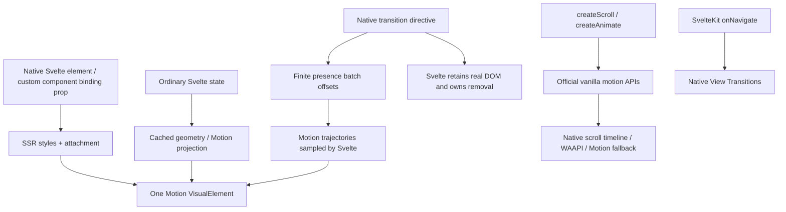

# Composition, scroll, timelines and aftercare

2026-09-05. Adopt this architecture with the documented beta boundaries. This round
finishes coordinated finite presence, improves component/SSR authoring, hardens the
real component lab, and adds optional scroll/timeline entrypoints. It does not claim
complete `motion/react` parity or production-device qualification.

## Nothing is wrong with using Motion's infrastructure

We already use Motion's actual VisualElements, MotionValues, projection nodes,
shared-element stacks, spring/interpolation machinery and scheduler. These work in
Svelte 5. The relevant distinction is the framework integration, not engine quality.
`motion/react` owns React lifecycle/context and cannot directly serve as a Svelte
adapter. The official vanilla `motion` entry works without React.

The Humanspeak wrapper also targets Svelte 5 and uses real Motion infrastructure.
Its [reproduced integration defects](humanspeak-audit.md), including idle geometry
polling and missed deep ancestor changes, are reasons to avoid adopting that wrapper
as our foundation. They are not evidence that Motion is incompatible or that the
project was AI-authored.

Direct dependencies are now pinned `motion-dom@13.2.0` and `motion@13.2.0`.
The latter transitively installs `framer-motion` because the vanilla facade still
lives in that package. Importing its documented vanilla facade does **not** import
React. React and ReactDOM are optional peers and are not installed here.

- Scroll and timelines use documented public [`scroll`](https://motion.dev/docs/scroll)
  and [`animate`](https://motion.dev/docs/animate).
- Projection/VisualElement/state/sampling integration still uses undocumented
  `motion-dom` **root exports**, with the existing exact pin and upgrade tests.
- No undocumented deep import, dependency patch, paid layout engine, Svelte clone,
  React runtime, custom spring solver or custom scroll/timeline engine was added.

## Architecture



The new presence batch calculates only start offsets and retention spans. Motion
calculates each finite trajectory and child stagger. Svelte remains the only clock
for native transitions. The parent stays in its transition state until its scheduled
descendants finish, preventing an early parent state refresh from restarting them.
Its `transitionEnd` still applies at the end of its own trajectory.

Deferred transition factories are collected in one batch. Svelte 5.57.0 probes each
returned duration immediately; a positive temporary probe keeps its native clock
alive until all factories contribute. A microtask schedules the batch before real
playback, with a first-tick flush for `flushSync`. Three-engine tests exercise this
ordering, normal updates, reversal and cleanup. This is a version-sensitive adapter
contract, not a new Svelte before-commit hook.

## Coordinated native presence and SSR inheritance

```svelte
<script lang="ts">
	import { createMotion } from 'astra-motion/state';
	let open = $state(true);
	const panel = createMotion({
		initial: 'hidden',
		animate: 'visible',
		exit: 'hidden',
		variants: {
			hidden: { opacity: 0 },
			visible: { opacity: 1 }
		},
		transition: { duration: 0.2, when: 'afterChildren', staggerChildren: 0.08 }
	});
	const title = panel.child({
		variants: {
			hidden: { opacity: 0, y: 12 },
			visible: { opacity: 1, y: 0 }
		}
	});
	const panelTransition = panel.transition;
	const titleTransition = title.transition;
</script>

<button onclick={() => (open = !open)}>Toggle</button>
{#if open}
	<section {...panel.props} transition:panelTransition>
		<h2 {...title.props} transition:titleTransition>Native elements, ordered exits</h2>
	</section>
{/if}
```

Use `beforeChildren`, `afterChildren`, or omit `when` for simultaneous trajectories.
`delayChildren`, Motion's stagger function, `staggerChildren` and stagger direction
apply to the native transitions participating in that batch. Nested branches keep
Svelte's ordinary local/global semantics: use `transition:alias|global` when a child
should participate in removal of an enclosing block. Existing wrapperless wait
`Presence`, popLayout, layout scopes and shared IDs compose with this path.

`parent.child(options)` explicitly declares **variant** ancestry for both SSR and
the live VisualElement tree. The child must attach inside the parent's DOM element.
An intervening motion element does not change this declared variant source;
projection ancestry still follows the actual DOM. Without `.child()`, live variants
can infer DOM ancestry but SSR cannot infer arbitrary markup. Explicit child styles
remain another option. `initial: false` propagates and does not replay child
keyframes during hydration or first native intro.

No compiler transform is required for this API. The optional compiler spike remains
research: it can shorten syntax, but cannot establish arbitrary DOM ancestry during
SSR or replace the runtime/lifecycle work. A production preprocessor has not earned
its tooling and compatibility cost yet.

## Custom components without mandatory engine imports

```svelte
<script lang="ts">
	import * as Card from '$lib/components/ui/card/index.js';
	import { createMotion } from 'astra-motion/state';
	const card = createMotion({
		initial: { opacity: 0, y: 12 },
		animate: { opacity: 1, y: 0 },
		exit: { opacity: 0, y: -12 },
		layout: true
	});
</script>

<Card.Root motion={card}>Content</Card.Root>
```

This replaces the project's earlier boolean/options `motion` convenience prop.
Widgets import `MotionBinding` as a type only. Bindings retain caller configuration,
SSR initial styles and lifecycle; ordinary widgets do not import the animation
runtime. Dialog accepts independent `motion` and `overlayMotion` bindings. Accordion
uses its existing two elements: native intrinsic-height reveal and a motion content
binding. See [complete component contract](bits-motion-integration.md).

The dialog resizing regression previously measured roughly **19.9% vertical scaling**
of input text through its ancestors. Existing content hosts now participate in
position correction, without added wrappers. The regression checks composed ancestor
matrices during repeated resizing rather than inspecting only the text's own style.
This does not eliminate every possible distortion in arbitrary user content: text
hosts need appropriate projection, and images need an intentional aspect/crop policy.

## Optional scroll and scoped timelines

```svelte
<script lang="ts">
	import { createScroll } from 'astra-motion/scroll';
	import { createAnimate } from 'astra-motion/animate';
	const reading = createScroll();
	const fill = reading.animate({ transform: ['scaleX(0)', 'scaleX(1)'] });
	const scene = createAnimate();
	function play() {
		return scene.sequence([
			['.tile', { y: -24 }, { duration: 0.25 }],
			'return',
			['.tile', { y: 0 }, { at: 'return', duration: 0.3 }]
		]);
	}
</script>

<div class="scroller" {@attach reading.container}>
	<div class="meter" {@attach fill}></div>
	<p>Scrollable content...</p>
</div>
<button onclick={play}>Play sequence</button>
<section {@attach scene.attach}><div class="tile">One scoped target</div></section>

<style>
	.scroller {
		position: relative;
		height: 180px;
		overflow: auto;
	}
	.scroller p {
		min-height: 600px;
	}
	.meter {
		position: sticky;
		top: 0;
		height: 4px;
		background: coral;
		transform-origin: left;
	}
</style>
```

Scroll includes window/container progress, target offsets, horizontal direction,
reactive options and native/fallback paths. Semantic progress remains active under
reduction; decorative linked animations finish. A controller-level subscription
settles links even during a retained outro whose attachment effects are paused.

Scopes resolve selectors inside their attached root, return Motion playback controls,
inherit defaults, cancel obsolete overlapping sequences and clean up on destruction.
Replay revalidates ownership and subtree membership. Infinite sequences are settled
through an instant replacement when reduction changes, since native `complete()`
cannot finish an infinite WAAPI animation.

A lightweight ownership registry diagnoses competing local state/layout, timeline,
and scroll writers in either mount order. Animate a state-bound element through its
binding or map scroll progress into its MotionValues; do not put a second visual
owner on it. See [scroll API and limits](scroll-support.md) and
[scoped timelines API and limits](scoped-timelines.md).

## Browser and API boundaries

- Core, shared local layout, finite presence, scroll fallback and timelines are tested
  in Chromium, Firefox and WebKit. Native scroll timelines are used where Motion and
  the browser support the selected target/properties. Decomposed transform animation
  can use Motion's JavaScript path; a working effect is not proof of acceleration.
- Route transitions remain the existing native View Transition enhancement with a
  graceful fallback. Their interruption model remains different from local springs.
- Pinned vanilla scroll options do not yet expose the newer `trackContentSize` API.
  Fallback content changes can need a later scroll/resize event to refresh geometry.
- Native presence supports finite resolved values, not repeated exits, unresolved
  `auto`/CSS variables, or arbitrary asynchronous safe-to-remove ownership. Changing
  reduction settles the pose but cannot shorten a Svelte clock already created.
- Scoped sequences currently support DOM/SVG targets; arbitrary objects, callbacks
  and MotionValue timelines remain available directly from official `motion`.
- Stopped Motion promises need not resolve. Cancellation cleanup does not await them;
  application async sequences should use their own abort/revision guard.
- This is not full drag/reorder/3D/gesture parity. Packaged-consumer checks, physical
  mobile profiling, long-session memory and exhaustive route/BFCache qualification
  remain release work. Runtime source HMR explicitly reloads the page.

## Independent review and regression changes

- Component reviewer replaced static runtime imports with binding props, reproduced
  dialog ancestor distortion, and added wait/popLayout/shared-group destruction tests.
- The same reviewer challenged inherited `initial: false` and intervening variant
  ancestors. The adapter now disables Motion's late-mount heuristic for initial:false
  and uses an explicit lexical VisualElement parent. SSR and 40 initial hydration
  frames are checked in all engines.
- Scroll tests caught native timelines remaining paused with `autoplay: false` and
  deferred cleanup overwriting restored styles. Linking is now synchronous before
  the next frame, and restoration is guarded against a new owner.
- Timeline tests caught replay cleanup, stale finished callbacks, replay outside the
  scope, and infinite animation reduction. Playback generations/epochs and ownership
  checks gate those lifecycle edges; Motion still performs all animation calculation.

Try `/motion-lab/presence`, `/motion-lab/components`, `/motion-lab/inheritance`,
`/motion-lab/scroll`, and `/motion-lab/timelines`. The main laboratory links to each.

## Qualification and measured size

| Check                                             | Result                        |
| ------------------------------------------------- | ----------------------------- |
| Full Chromium suite                               | 178/178 in 90.38 s            |
| Full Firefox suite                                | 178/178 in 94.99 s            |
| Full WebKit suite                                 | 179/179 in 127.89 s           |
| Final scoped-timeline regression suite            | 14/14 per engine, 42/42 total |
| Server/compiler suite                             | 52/52                         |
| Real SvelteKit routes, history, SSR and hydration | 30/30, one worker, 58.9 s     |
| Svelte check                                      | 0 errors, 0 warnings          |
| Motion runtime/lab/route/test ESLint and Prettier | Pass                          |
| Changed Svelte source autofixer                   | Zero issues/suggestions       |

One additional paint-only transform test was added between engine runs; the final
42-case focused run qualifies that change in all three engines. Browser cases are
not summed across these overlapping runs as if they were unique tests. The final
full runs used sequential engines to avoid the shared-machine contention observed
in earlier parallel qualification.

Chrome agent-browser screenshots were inspected for coordinated presence, scroll,
timelines, expanded dialog and inherited variants. The root presence exercise
performed 16 reversals at 45 ms intervals across both ordering modes: both original
parent nodes survived, all six sampled opacities settled at 1, zero native animations
remained, and page/console errors were empty. The existing 100-participant paint-only
geometry-read regression remains part of the full suite. Earlier 1/10/100/500 layout
traces remain the performance record; this round did not run physical-device traces.

Current isolated in-memory ESM gzip sizes (Svelte/SvelteKit external/shared):

| Entry                                        | Bytes gzip |
| -------------------------------------------- | ---------: |
| Presence only, including import through root |        935 |
| Wait + presence                              |      1,218 |
| Routes                                       |      1,153 |
| Layout only                                  |     29,899 |
| State/layout/interaction                     |     39,035 |
| Scoped animate/timelines                     |     23,059 |
| Scroll                                       |     25,379 |
| Entire local API                             |     48,242 |
| Entire API including routes                  |     49,064 |

Separate entry sizes include their own engine dependencies; **do not add them** to
estimate a combined bundle, which deduplicates shared code. No measured bundle
contains React. [Raw minified/gzip/Brotli results](bundle-sizes.json) and
[qualification manifest](composition-validation.json) record the current checkpoint.
No application build, package publication or deployment was run.
