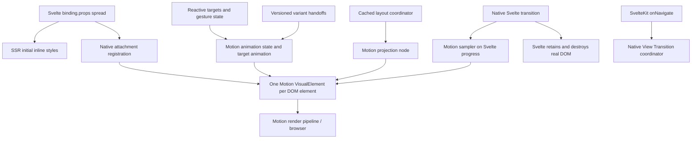

# State expansion and adoption decision

2026-09-05. Recommendation: **adopt the Motion DOM adapter with the documented beta
boundaries**. Keep the exact engine pin and native-element API. Compiler attributes
remain optional future authoring work. No additional animation engine or Svelte clone
was installed.

Latest composition/scroll work is documented in [composition and aftercare](composition-scroll-timelines.md).

## What changed

| Capability                  | Implemented contract                                                                                                    |
| --------------------------- | ----------------------------------------------------------------------------------------------------------------------- |
| Initial/update/exit targets | `createMotion(() => options)`; objects, keyframes, named and custom variants                                            |
| State plus layout           | One HTMLVisualElement, one set of MotionValues, one transform/projection pipeline                                       |
| SSR                         | `.props` includes deterministic resolved initial styles and an attachment key; `initial: false` renders final keyframes |
| Presence                    | Native `transition:bindingAlias` retains the actual node; Motion samples finite springs/keyframes on Svelte's clock     |
| Wait/popLayout              | Existing wrapperless `Presence` and flow-removal attachment compose with the new transition                             |
| Defaults                    | `MotionConfig` context, nested overrides, live OS preference/config changes                                             |
| Variants/orchestration      | Inherited labels, custom resolvers, stagger, before/after children; obsolete deferred handoffs are canceled             |
| Values                      | Official Motion value/spring/derived/mapped factories plus the small writable `motionStore` bridge                      |
| Interaction                 | Hover, tap/keyboard feedback, focus-visible, viewport, pan, bounded numeric drag and Motion inertia                     |
| Components                  | Opt-in motion on the actual shadcn accordion, dialog/overlay and cards, preserving Bits lifecycle                       |

Complete native-element examples: [state API](state-api.md). Try
`/motion-lab/state` and `/motion-lab/components`. The original and extended labs still
exercise local/shared layout, wait, popLayout, scrolling and route transitions.

## Runtime ownership

The registry creates ancestors first even though Svelte attaches children first.
State updates are batched after binding props commit and evaluated children first,
so inherited variants refresh their protected values before the parent orchestrates
them. Projection reconfiguration preserves the VisualElement and external values.
Cleanup invalidates pending sequences, stops native presence sampling, removes
subscriptions/recognizers, restores owned styles, and releases the projection tree.

The presence sampler uses Motion's JSAnimation interpolation and spring duration;
it does not start another animation clock. Its identity easing and lazy duration
read Svelte's actual counterpart progress when reversal starts, rather than a stale
progress captured one frame earlier. Gestures can take over an incoming animation
from its current pose. Outgoing elements remain governed by Svelte presence.

## Why some glue is custom

- **Observation and lifecycle:** Svelte supplies no general reliable precommit hook
  inside an attachment; the existing cached geometry coordinator remains necessary.
- **Finite native presence clock:** Svelte's public transition contract cannot await
  an arbitrary animation promise. Sampling Motion trajectories lets Svelte retain
  real DOM and reverse it without a React-like ownership system.
- **Cancellable orchestration:** a repeated WebKit test reproduced an old
  `beforeChildren` completion dispatching an obsolete child label after the new label
  settled. `animation.ts` gates deferred handoffs and `transitionEnd` with versions
  and lifecycle epochs. Motion still resolves variants, calculates child delays,
  arbitrates property priority and animates each target. The adapter does not supply
  interpolation, physics, projection math or a frame engine.
- **Pointer integration:** public hover/press recognizers are reused. Numeric drag
  needs pointer capture and lifecycle glue because the complete framework drag
  controller is not exposed as the desired root API. Motion owns velocity/inertia.

`motion-dom@13.2.0` supplies local state/projection; `motion@13.2.0` now supplies
documented vanilla scroll and timeline APIs. React peers remain optional and uninstalled. Projection,
VisualElement, animation-state injection and sampling APIs are root exports with
**undocumented integration/upgrade risk**. `setAnimateFunction` is upstream internal
injection infrastructure. Re-run the compatibility suite before any engine upgrade.
No React, Vue runtime, wrapper package, paid layout runtime, deep import or patched
Motion package is foundational.

## Independent findings and resulting fixes

- **External implementation audit:** reproduced idle layout reads, missed deep
  ancestor changes, skipped legacy media exits and compiler literal corruption in
  the pinned Humanspeak checkout. Its real Motion DOM architecture supplied useful
  lessons; these defects do not establish AI authorship. [Audit and repros](humanspeak-audit.md).
- **Motion/lifecycle specialist:** found inherited children stuck at previous targets,
  live reduced policy restoring an outgoing element, delayed stale WebKit variants,
  and intro interactions being dropped. Added strict intermediate/final assertions;
  the adapter now handles each lifecycle boundary explicitly.
- **Component/API specialist:** reproduced `initial: false` keyframe replay and
  exposed unguarded imperative/presence competition. Verified actual Bits focus,
  Escape, real-node retention, nested defaults and custom-root forwarding. Identified
  the static wrapper import cost, since removed by accepting caller-created bindings.
- **Gesture/browser specialist:** qualified public Motion recognizers, real pointer
  capture, inertia interruption and cleanup; caught missing dynamic pan availability.
  Authored the interactive state lab and three-engine/mobile checks.

## Limits to retain in the public contract

- One binding belongs to one simultaneous native HTMLElement. Reuse after removal
  is supported. Custom components forward `.props` to an explicit root and place the
  transition on that root; an attachment alone cannot retain a destroyed component.
- Shared defaults are context: create bindings in descendant components. A provider
  written later in the same component does not retroactively configure earlier bindings.
- SSR parent variant inheritance cannot be inferred from arbitrary native markup.
  `parent.child(options)` now declares that relationship explicitly for both SSR and
  the live variant tree. Otherwise use explicit initial objects/styles.
- Presence requires finite resolved targets. `auto`, unresolved CSS-variable values,
  infinite/repeated exits and arbitrary timeline retention are not supported.
- Reducing motion settles a retained exit visually, but cannot shorten Svelte's
  already-created native retention clock. Externally created spring values retain
  their own policy/ownership. Gesture feedback uses Motion's reduced-transform policy.
- `.animate()` is mounted/present-only and honors reduction; reverse an exit through
  Svelte state. `.stop()` stops value/sampled state animation, not layout projection.
- Motion owns the bound element's transform. Existing incompatible transforms are
  diagnosed; raw transform strings cannot combine with layout or decomposed targets.
  Arbitrary transformed ancestors and all 3D/sticky/crop combinations remain outside
  the qualification matrix. Text/image hosts still need appropriate child projection.
- Drag supports numeric x/y constraints, not element-reference constraints,
  transformed coordinates, elasticity, direction locking or full reorder controls.
- Native component HMR uses Svelte's lifecycle. Editing the motion runtime itself
  explicitly reloads the page because its old projection/visual owners cannot safely
  survive replacement. This is a development behavior, removed from production bundles.
- Project-local shadcn components now accept `motion={binding}` through type-only
  imports. The earlier boolean/options convenience API has been replaced; creation
  and initial server styles belong to the caller.
- Routes remain native snapshots, with separate scoped route IDs. They do not promise
  local-spring retargeting; real BFCache, streamed content and device testing remain
  release qualification work.

## Concrete next steps

1. Use the two new labs and integrate these bindings into the library's real screens.
   Keep regressions for every observed visual fault, including intermediate geometry.
2. Establish packaged-consumer and real mobile performance budgets, then run
   long-session mount/unmount, route history and memory traces. Development/headless
   numbers are evidence, not a release performance guarantee.
3. Seek a supported Motion integration boundary for projection/state orchestration,
   retaining the current pin until compatibility tests qualify an upgrade.
4. Keep the tiny presence-only entry and layout-only entry independently importable;
   measure packaged consumers of the new binding-prop component contract.
5. Add optional compiler syntax only after this runtime/API contract stabilizes.
   Structured preprocessing can remove imports/spreads/directive boilerplate; it
   cannot infer runtime geometry or repair lifecycle races.

This now covers substantially more of the original goal, including the requested
state and gesture expansion. It is not a claim of the complete Motion React product
surface or years of browser hardening. [Validation and actual measurements](validation.md)
remain the acceptance record.
